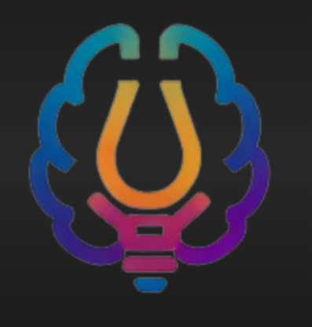

# 🧠💀 BRAINROT — AI Chat Interface using Gemini API



**BRAINROT** is your **unhinged AI bestie** — a chaotic, Gen-Z-flavored AI chat assistant that delivers **real-time streaming AI responses** in a sleek modern interface.

Built with **React + AI streaming**, this project focuses on creating a smooth chat experience with a playful internet-style personality.

---

## 📌 Problem Statement

Many users want quick access to AI assistants for answering questions, generating content, or solving problems. However, building a full-scale AI system is complex and resource-intensive.

This project aims to develop a **simple web-based AI assistant interface** that allows users to interact with an AI model using natural language queries.

---

## 🎯 MVP (Minimum Viable Product)

The Minimum Viable Product is the simplest version of the system that delivers the core functionality.

### MVP Includes:
- ✅ A web-based chat interface
- ✅ User prompt input
- ✅ Integration with the Gemini API
- ✅ AI-generated response display
- ✅ Basic conversation flow

The MVP demonstrates how a frontend interface communicates with an AI model through an API to generate responses in **real time**.

---

## 🚀 Core MVP Features

### 1. Chat Interface
A simple UI where users can type prompts and view responses.
- **Technologies:** React, Tailwind CSS, shadcn/ui

### 2. Prompt Processing
The system accepts user input and sends it to the backend server.
- Capture user query
- Send API request

### 3. AI Response Generation
The backend connects to **Google Gemini** to generate intelligent responses.
- **Model:** `gemini-3-flash` (via Lovable AI Gateway)

### 4. API Integration
The application securely integrates with the AI model using a backend Edge Function.
- Prompt submission
- Response retrieval
- Real-time streaming interaction

---

## 🏗️ System Architecture

```
User
  ↓
Frontend (React Chat UI)
  ↓
Backend (Edge Function)
  ↓
Gemini API (via AI Gateway)
  ↓
AI Response (SSE Stream)
  ↓
Frontend Display (Token-by-token)
```

---

## 📦 MVP Scope

### ✅ Included in MVP
- Basic chat UI
- Gemini API integration
- Text prompt & response
- Simple conversation display
- Real-time streaming responses
- Markdown rendering

### 🔮 Not Included (Future Enhancements)
- Chat history persistence
- User authentication
- Voice input
- Image input
- Context memory
- Multi-model support
- AI prompt suggestions
- Multi-conversation threads
- Personalized AI assistant

---

## 🛠️ Tech Stack

| Layer | Technology |
|-------|-----------|
| **Frontend** | React, TypeScript, Vite, Tailwind CSS, shadcn/ui |
| **AI Model** | Google Gemini 3 Flash |
| **AI Gateway** | Lovable AI Gateway |
| **Backend** | Lovable Cloud (Edge Functions) |
| **Streaming** | Server-Sent Events (SSE) |

---

## ⚙️ Getting Started

### 1️⃣ Clone the Repository

```bash
git clone https://github.com/Keerthipriya27/BRAINROT.git
```

### 2️⃣ Navigate into the Project

```bash
cd BRAINROT
```

### 3️⃣ Install Dependencies

```bash
npm install
```

### 4️⃣ Start Development Server

```bash
npm run dev
```

The app will start locally on:

```
http://localhost:5173
```

---

## 📂 Project Structure

```
src/
├── components/       # UI components (ChatMessage, ChatInput, etc.)
├── lib/              # Utility functions (streamChat helper)
├── pages/            # Page components
└── integrations/     # Backend client configuration

supabase/
└── functions/
    └── chat/         # Streaming chat edge function
```

---

## 💡 How It Works

1. User sends a message through the chat interface.
2. The message is sent to the backend **Edge Function**.
3. The backend communicates with the **Gemini 3 Flash model** through the AI Gateway.
4. Responses are **streamed back to the frontend in real time** using SSE.
5. Tokens are rendered **as they arrive** for a smooth chat experience.

---

## 🎯 Expected Outcome

The MVP successfully demonstrates how a web interface can interact with a generative AI model to provide intelligent responses, forming the foundation for more advanced AI-powered applications.

---

## 👩‍💻 Author

**Keerthipriya**

🔗 LinkedIn: [Keerthipriya Peddada](https://www.linkedin.com/in/keerthipriya-peddada-9b9a7034b/)

💻 GitHub: [Keerthipriya27](https://github.com/Keerthipriya27)

---

## 🤝 Contributing

Contributions are welcome!

1. Fork the repository
2. Create a new branch
3. Commit your changes
4. Open a Pull Request

---

## 📜 License

This project is licensed under the **MIT License**.

---

⭐ If you like this project, consider **starring the repository**.
